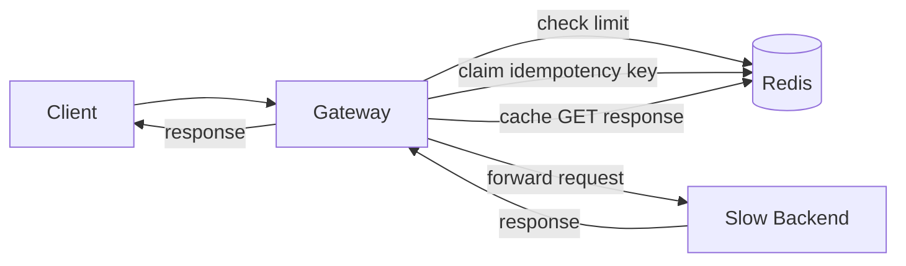

# Rate-Limited, Idempotent API Gateway

> **TL;DR:** A gateway that sits in front of a slow backend and adds three
> things no individual backend call gives you for free: per-client rate
> limiting that's correct across multiple gateway instances, idempotent
> writes so a retried request can't double-process a payment/order, and
> cached reads. The rate limiter is built as two implementations
> deliberately: a naive fixed-window counter, and a test that *proves* its
> well-known boundary-burst flaw, followed by a token-bucket implementation
> that fixes it — verified by the same test passing against both.

## The problems this solves

- **A client retries a POST after a timeout.** Maybe the first request
  actually succeeded and only the *response* was lost in transit. Without
  idempotency, the retry creates a second order / charges a second time.
  This is a real, common failure mode — it's why Stripe's API requires an
  `Idempotency-Key` header on every write.
- **Rate limiting an in-process counter doesn't work once you run more
  than one gateway replica** — each replica would enforce the limit
  independently, silently allowing `N × replicas` through. This gateway
  stores limiter state in Redis specifically so it's correct under
  horizontal scaling, not just on a single box.
- **A naive rate limiter can let through 2x its nominal limit** if a
  client sends a burst right at a window boundary. This is disclosed and
  *proven by test* below, not glossed over.

## Architecture



## Rate limiting: two implementations, on purpose

| | `FixedWindowLimiter` | `TokenBucketLimiter` |
|---|---|---|
| Mechanism | Redis `INCR` + `EXPIRE` on a wall-clock window key | Redis `WATCH`/`MULTI` optimistic transaction on a token count + last-refill timestamp |
| Atomicity | Trivial — `INCR` is atomic by itself | Requires a real read-modify-write (tokens depend on elapsed time), so this uses optimistic concurrency control: read, compute, commit-if-unchanged, retry on conflict |
| Known flaw | **Boundary burst**: up to 2x the nominal limit can pass in a short span straddling a window reset — proven in `test_fixed_window_boundary_burst_flaw` | None of that kind — refill is continuous, not a hard reset, proven by `test_token_bucket_fixes_the_fixed_window_boundary_flaw` running the identical scenario |
| Used in production entrypoint (`gateway/app.py`)? | No — kept in the codebase specifically as the tested, documented cautionary example | Yes |

Worth calling out: `CineReserve` (a separate project) handles concurrent
seat booking with **pessimistic locking** (`SELECT ... FOR UPDATE`) — the
right choice there because many clients contend for the *same* seat row.
Here, each client has its own bucket key, so contention per key is low and
**optimistic** retry (cheaper when conflicts are rare) is the better fit.
Same underlying problem class (safe concurrent read-modify-write), two
different tools, chosen for different contention profiles on purpose.

## Idempotency: the state a lot of implementations get wrong

Checking "does a cached response already exist?" isn't enough — it says
nothing about a request that's *currently* being processed by another
in-flight request with the same key. This implementation uses a real
three-state claim (modeled on Stripe's publicly documented approach):

```
(missing) --SETNX--> PENDING --complete()--> COMPLETED(response)
```

`SETNX` (set-if-not-exists) is atomic, so exactly one concurrent request
wins the claim. Everyone else sees either `PENDING` (told to retry
shortly — a `409`, not silently processed) or `COMPLETED` (gets the
original response back). `test_concurrent_duplicate_requests_still_hit_backend_only_once`
proves this under genuine thread concurrency, not just sequential calls
that a weaker implementation could pass by accident.

## Verified evidence

**21 tests, all passing**, run against `fakeredis` (no external Redis
process needed to develop/test) and the real backend app running
in-process (so "the backend was only hit once" is measured against real
request handling, not a mock):

```bash
pip install -r requirements.txt
python -m pytest tests/ -v
```

`scripts/demo_load_test.py` fires real concurrent HTTP load against a
running `docker-compose up` stack and prints measured pass/fail evidence
for idempotency, rate limiting, and caching. **Disclosure:** this script
was written and is exercised by the test suite's logic, but Docker/Redis
weren't available in the environment this was developed in to run the
live multi-container demo itself — the correctness claims above rest on
the 21 passing tests against real backend logic, not on this script's
output. Run it yourself with `docker-compose up -d` to see it live.

## Running it

```bash
docker-compose up -d
curl -X POST http://localhost:8080/orders \
  -H "Idempotency-Key: demo-1" \
  -H "Content-Type: application/json" \
  -d '{"item": "widget", "amount_cents": 500}'

python scripts/demo_load_test.py
```

## Known limitations

- **Redis is a single point of failure here.** A production deployment
  would run Redis in a highly-available configuration (Sentinel/Cluster);
  this project's `docker-compose.yml` runs a single instance, which is
  enough to demonstrate correctness, not enough for real availability.
- **The gateway forwards a generic JSON body**, not a schema-validated
  one — it's a gateway concern (rate limit / idempotency / cache), not a
  full re-implementation of the backend's request validation.
- **`TokenBucketLimiter`'s optimistic retry can fail closed** (deny the
  request) if it exhausts its retry budget under extreme contention on
  the *same client's* bucket key. This is intentional — failing closed
  under a condition this rare is safer than silently skipping the rate
  check — but it's a real tradeoff, not a free lunch.
